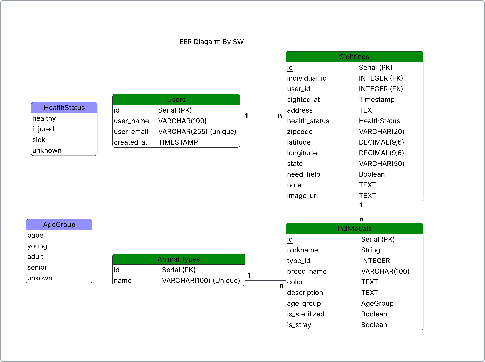
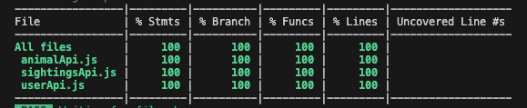

# paw-tector
Paw-tector is a community-based web application that allows volunteers to record stray animal sightings and track their health status over time.
The goal is to support local shelters and TNR (Trap-Neuter-Return) programs by identifying frequently sighted animals and hotspot areas.

## Demo


## 🚀 Features

### 🐾 Track Animals

- Create a new tracked animal
    
- Attach an **initial sighting** when creating an animal
    
- Edit and update animal information
    
- Delete tracked animals
    
### 👀 Sightings

- Add sightings to **existing animals**
    
- Track when and where animals were seen
    
- Record health status and notes
    
- View a full **sighting timeline** for each animal
    
### 🔎 Search & Filters

Users can search animal records using:

- substring search (nickname, etc.)
    
- animal type
    
- health status
    
- date range


Search results support **pagination**.

### 📊 User Statistics

Each volunteer can view:

- number of animals tracked
    
- number of sightings recorded
    
- number of locations contributed
    

### 🐱 Animal Profile Page

Each animal has a dedicated profile page displaying:

- animal information
    
- sighting history
    
- related statistics

## 🛠 Tech Stack

- Frontend: React, JavaScript, CSS
- Backend: Node.js, Express
- Database: PostgreSQL
- Other: REST API, useContext for state management

- Pagination queries

## Architecture Design

### 🗂 Database design (ERD)
Paw-tector uses a relational PostgreSQL database to model users, animals, and community sightings.


##  APIs
### Users Related APIs
- GET `/api/users`
- GET `/api/users/${userId}/tracked-animals`
- GET `/api/users/${userId}/stats`
- PUT  `/api/users/${userId}/tracked-animals/${individualId}`
- DELETE `/api/users/${userId}/tracked-animals/${individualId}`
  
### Animal related APIs
- GET `/api/individuals/${animalId}`
- GET `/api/individuals/${animalId}/stats`

### Sightings related APIs
- GET `/api/sightings?page=${page}&limit=12`
- POST `/api/users/${Number(user_id)}/tracked-animals`
- POST `/api/users/${Number(user_id)}/sightings`
- GET `/api/sightings/stats`
- GET `/api/sightings/search?${query}`

## Testing

### Frontend API tests were implemented using Vitest.

Covered functions include:

- Fetch sightings list
- Fetch sightings statistics
- Search sightings with filters
- Create tracked animal with sighting
- Add new sighting to existing animal
- Fetch animal history
- Fetch animal statistics



### Frontend component tests were implemented using Vitest and React Testing Library.
- Rendering form fields correctly based on component mode
- Handling user input changes
- Submitting forms and triggering API calls
- Conditional rendering for different component states

## How to start
### Clone respository
```bash
git clone https://github.com/shuwangs/paw-tector.git
cd pawtector
```

### Install dependencies
```bash
# backend dependencies
cd server
npm install

# frontend dependencies
cd client
npm install

```

### Setup database
Make Sure you have postgresql installed. If not: 
```bash
brew install postgresql
brew services start postgresql
```

You can initilize the database below:
#### Run schema + seed manually
```bash
# Drop database if it exists
dropdb --if-exists pawtector

# Create database
createdb pawtector

# Create schema and tables
psql -d pawtector -f server/db/schema.sql

# Insert seed data
psql -d pawtector -f server/db/seed.sql
```

### Environment Variable
Create a .env file inside the `server` folder:
```bash
DATABASE_URL=postgresql://localhost:5432/pawtector
PORT=3001
```

### Start the App
```bash
# Start backend
cd server
npm install
npm run dev

# Start frontend
cd ../client
npm install
npm run dev
```

## 🧪 Future Improvements

Potential future features:

- user authentication

- map visualization of sightings

- image upload for animals

- automated testing

- rate limiting

## 📚 What I Learned

This project helped me practice:

- building a full-stack PERN application

- designing RESTful APIs

- structuring React apps using Context API

- managing relational data with PostgreSQL

- implementing search + pagination


## ⭐ Acknowledgements

Built as part of the Techtonica Full-Stack Software Engineering Program.