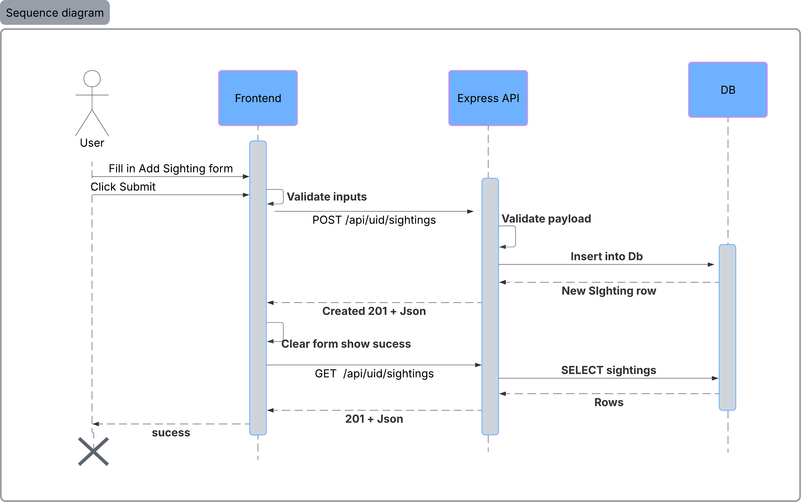

# paw-tector
Paw-tector is a community-based web application that allows volunteers to record stray animal sightings and track their health status over time.
The goal is to support local shelters and TNR (Trap-Neuter-Return) programs by identifying frequently sighted animals and hotspot areas.


## Architecture Design

### 🗂 Database Design (ERD)
Paw-tector uses a relational PostgreSQL database to model users, animals, and community sightings.

### 🔄 Sequence Diagram – Create a Sighting
The following diagram illustrates the end-to-end flow when a volunteer submits a new sighting from their profile page.



## 🛠️ MVP: Core Technical Requirements

### 1. Database (PostgreSQL)
Schema Creation: Build three tables with the following mandatory fields:

Species: id, common_name, scientific_name, estimated_wild_count, conservation_status, created_at.

Individuals: id, nickname, species_id (FK), created_at.

Sightings: id, sighting_date, individual_id (FK), location (text), is_healthy (boolean), sighter_email.

Initial Data: A db.sql file containing:

3+ Species.

2+ Individuals per species.

5+ Sightings.

### 2. Backend (Node.js & Express)
GET /api/sightings: A route that uses a SQL JOIN to fetch sighting details along with the nickname of the animal from the Individuals table.

POST /api/sightings: A route to receive form data and insert a new record into the database.

Data Validation: Ensure the backend checks that required fields (like email and date) are present before saving.

### 3. Frontend (React)
Dashboard/List View: Display the list of all sightings in a clean format (utilizing the data from your JOIN query).

Add Sighting Form: A functional form that includes:

A dropdown to select an Individual.

Inputs for Location, Date, and Email.

A toggle/checkbox for Health Status.

State Management: Use useState to handle form inputs and useEffect to fetch data from your API.

### 4. Testing & Documentation
Unit Test: Use Jest to test at least one component (e.g., checking if the "Add New" button triggers a function).

Integration Test: A simple test for your API endpoints (GET/POST).

README: Clear instructions on how to clone, npm install, and run the app.

🌟 Optional Features (Bonus)
Since you have already designed a very high-quality UI, these would be the "cherry on top":

Filtered View: A checkbox to filter the sightings list to show only "Healthy" animals (logic handled in React).

Individual Detail Page: Click a nickname to see all sightings specifically for that one animal.

Map Integration: Using the coordinates from your wireframe to show pins on a map.

Search Bar: Search sightings by species or location.

## Steps

- [X] Schema + seed + db.sql 
- [ ] Sighting CRUD API 
- [ ] Discovery（JOIN list）
- [ ] My Records（form + CRUD）
- [ ]tests（API + component）
- [ ] Needs Help filter（React-only）
- [ ]hotspots / stats / detail page


## Backend
```bash
npm install express cors dotenv pg
npm install --save-dev nodemon
```


## Client
```bash
npm install react-router-dom react-bootstrap bootstrap
```